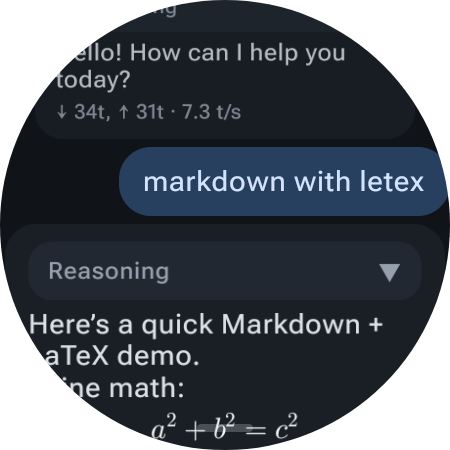
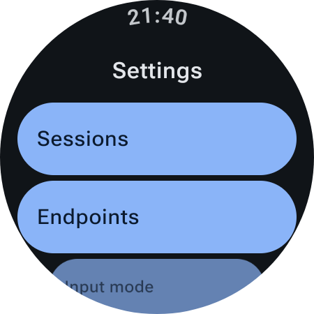
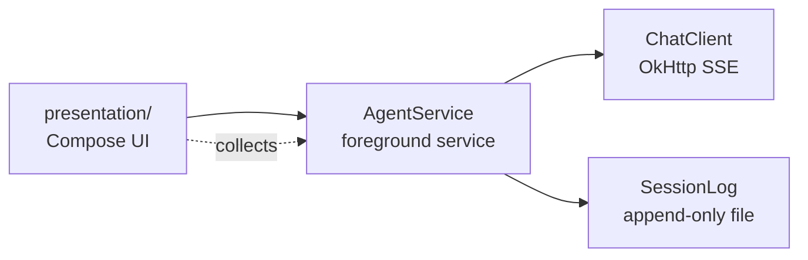

# WearAgent

**English** | [中文](README_zh.md)

<p align="center">
  
  
</p>

A lightweight AI chat client for Wear OS round-screen watches. Talk to any OpenAI-compatible API (or Anthropic) right from your wrist, with streaming replies, thinking traces, and Markdown/LaTeX rendering — all within the constraints of a watch: small screen, limited memory.

## Features

- **Streaming chat** — SSE streaming for OpenAI Completions / Responses and Anthropic Messages APIs
- **Round-screen native UI** — official Wear Compose Material 3
- **Pull-up drawer** — a drag handle hovers 9dp above the screen bottom; pull up for the input bar, pull further for Settings
- **Markdown + LaTeX** — CommonMark with GFM tables/strikethrough; `$..$`, `$$..$$`, `\(..\)` and `\[..\]` formulas rendered inline or as blocks via JLaTeXMath, with literal dollars and code spans left untouched
- **Thinking traces** — reasoning models (e.g. DeepSeek) stream their chain of thought into a collapsible block inside the reply bubble; it auto-expands while thinking, auto-collapses when the body starts, and is persisted with the message
- **Token usage** — each reply shows `↓ out, ↑ in (cached) · t/s`
- **Message actions** — long-press a bubble for a fullscreen action page: copy, select text, regenerate (works on user messages too), edit, delete
- **Session log** — append-only one JSON object per line (JSONL); a killed process replays the file, nothing lives only in memory
- **Foreground service** — one turn runs in a foreground service with a notification Stop action; stopping persists partial output
- **Endpoint profiles** — multiple endpoints, per-endpoint API type/key/model, auto model-list fetching
- **i18n** — Chinese (default) and English

## Architecture



- `agent/` — no Android UI dependencies. `ChatClient` (SSE streaming, usage parsing, model fetching), `AgentService` (turn lifecycle), `Transcript` (provider-agnostic history items)
- `session/` — DataStore-backed settings (endpoint profiles, input mode, display options) and the append-only session log
- `presentation/` — Wear Compose UI: chat (curved/flat lists), pull-up drawer, fullscreen action/edit/select pages, settings, Markdown/LaTeX renderer

## Build

Requires JDK 17+, Android SDK 36.

```bash
gradlew.bat :app:assembleDebug
adb install -r app/build/outputs/apk/debug/app-debug.apk
```

## Setup

1. Open the app → pull up the drawer → Settings
2. Endpoints → New endpoint
3. Fill endpoint URL (e.g. `https://api.example.com`) and API key
4. Fetch model list → pick a model (or type one manually)
5. Pull up → type → send

## TODOs

- **Harness** — planned watch-side tool execution and a multi-round tool loop.

## License

This program is free software: you can redistribute it and/or modify it under the terms of the GNU Affero General Public License as published by the Free Software Foundation, either version 3 of the License, or (at your option) any later version. See [LICENSE](LICENSE).
