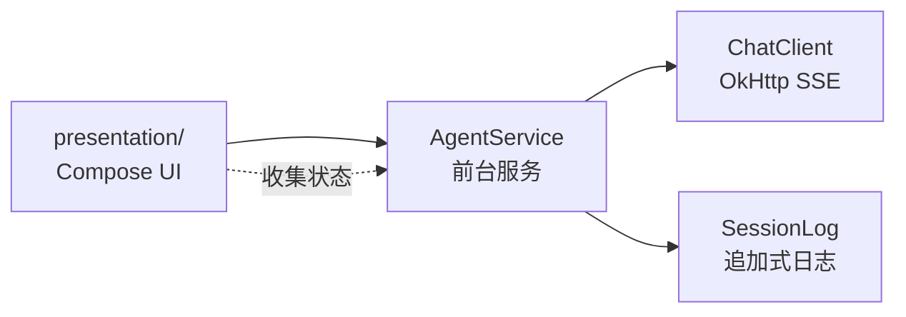

# WearAgent

[English](README.md) | **中文**

<p align="center">
  
  
</p>

一个为 Wear OS 圆屏手表打造的轻量 AI 聊天客户端。在手表上直接对话任意 OpenAI 兼容接口（或 Anthropic），支持流式回复、思维链展示、Markdown/LaTeX 渲染 —— 全部在手表的约束内完成：小屏幕、低内存。

## 功能

- **流式聊天** —— OpenAI Completions / Responses 和 Anthropic Messages 的 SSE 流式输出
- **圆屏原生 UI** —— 官方 Wear Compose Material 3
- **上拉抽屉** —— 把手常驻离底 9dp；上拉出输入框，再拉出设置
- **Markdown + LaTeX** —— Commonmark（GFM 表格/删除线）；`$..$`、`$$..$$`、`\(..\)`、`\[..\]` 四种公式定界符，行内或块级均用 JLaTeXMath 渲染；转义美元符与行内代码不被误判
- **思维链** —— 推理模型（如 DeepSeek）的思考过程流入回复气泡内的可折叠块：思考中自动展开，正文开始自动收起，随消息持久化保存
- **Token 用量** —— 每条回复底部显示 `↓ 输出, ↑ 输入 (缓存) · t/s`
- **消息操作** —— 长按气泡弹出全屏操作页：复制、选择文本、重新生成（用户消息也支持）、修改、删除
- **会话日志** —— 每行一个 JSON 对象（JSONL）的追加式格式；进程被杀后按文件重放，内存不独占任何数据
- **前台服务** —— 每回合在前台服务中运行，通知栏带停止按钮；停止时保留已生成的部分内容
- **多接口配置** —— 多个 endpoint 档案，各自独立 API 类型/密钥/模型；自动获取模型列表
- **国际化** —— 中文（默认）与英文

## 架构



- `agent/` —— 无 Android UI 依赖。`ChatClient`（SSE 流、usage 解析、模型列表）、`AgentService`（回合生命周期）、`Transcript`（供应商无关的历史条目）
- `session/` —— DataStore 设置（接口档案、输入方式、显示选项）与追加式会话日志
- `presentation/` —— Wear Compose UI：聊天（弯曲/平铺列表）、上拉抽屉、全屏操作/编辑/选择页、设置、Markdown/LaTeX 渲染器

## 构建

需要 JDK 17+、Android SDK 36。

```bash
gradlew.bat :app:assembleDebug
adb install -r app/build/outputs/apk/debug/app-debug.apk
```

### 发布签名

`assembleRelease` 在配置了发布密钥时使用正式签名，否则回退到 debug 密钥（保证本地构建可用）。
本地配置写在 `keystore.properties`（已 gitignore，可复制 `keystore.properties.example`）：

```properties
storeFile=keystore/wearagent.jks
storePassword=...
keyAlias=wearagent
keyPassword=...
```

CI 通过同名环境变量传入这些值（`SIGNING_STORE_FILE`、`SIGNING_STORE_PASSWORD`、
`SIGNING_KEY_ALIAS`、`SIGNING_KEY_PASSWORD`），由仓库 secrets（`KEYSTORE_BASE64`、
`KEYSTORE_PASSWORD`、`KEY_ALIAS`、`KEY_PASSWORD`）填充。发布流程在缺少密钥时会直接失败，
并校验产物不是 debug 签名。

请务必保管好密钥库：丢失后将无法用同一包名更新已安装的正式版本。

## 配置

1. 打开应用 → 上拉抽屉 → 设置
2. 接口 → 新接口
3. 填接口地址（如 `https://api.example.com`）和密钥
4. 获取模型列表 → 选择模型（或手动输入）
5. 上拉 → 输入 → 发送

## TODOS

- **Harness** —— 计划实现手表端工具执行与多轮工具循环。

## 许可证

本程序为自由软件：你可依据自由软件基金会发布的 GNU Affero 通用公共许可证（第 3 版或任意后续版本）重新分发或修改它。详见 [LICENSE](LICENSE)。
